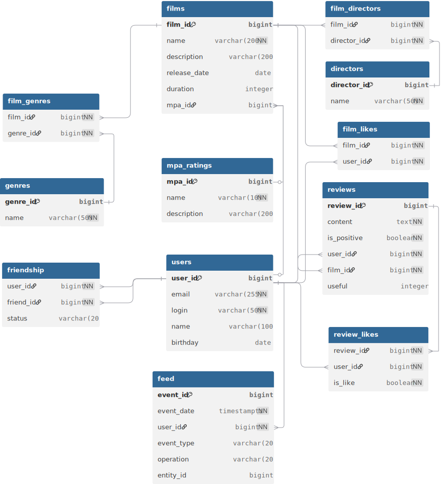

# Filmorate - Social Network for film rating

Filmorate is a social network  where users can share information about films, rate them, and find like-minded people.

## Database Schema



## Database Structure Explanation

The database consists of 7 main tables:

### Core Tables:
- **users** - stores user information
- **films** - stores film information
- **mpa_ratings** - MPA rating catalog (G, PG, PG-13, R, NC-17)
- **genres** - film genres catalog

### Relationship Tables:
- **film_genres** - many-to-many relationship between films and genres
- **film_likes** - tracks which users liked which films
- **friendship** - tracks friendships between users

## Key SQL Query Examples

### 1. Get All Films with MPA Ratings and Genres
```sql
SELECT f.film_id, f.name, f.description, f.release_date, f.duration,
       m.name as mpa_rating,
       GROUP_CONCAT(g.name) as genres
FROM films f
LEFT JOIN mpa_ratings m ON f.mpa_id = m.mpa_id
LEFT JOIN film_genres fg ON f.film_id = fg.film_id
LEFT JOIN genres g ON fg.genre_id = g.genre_id
GROUP BY f.film_id;
```

### 2. Get Popular Films (Top N by Likes)
```sql
SELECT f.film_id, f.name, COUNT(fl.user_id) as likes_count
FROM films f
LEFT JOIN film_likes fl ON f.film_id = fl.film_id
GROUP BY f.film_id
ORDER BY likes_count DESC
LIMIT 10;
```

### 3. Get User's Friends
```sql
SELECT u.user_id, u.name, u.email
FROM friendship f
JOIN users u ON f.friend_id = u.user_id
WHERE f.user_id = 1;
```

### 4. Get Common Friends Between Two Users
```sql
SELECT u.user_id, u.name
FROM friendship f1
JOIN friendship f2 ON f1.friend_id = f2.friend_id
JOIN users u ON f1.friend_id = u.user_id
WHERE f1.user_id = 1 AND f2.user_id = 2;
```

### 5. Add Like to Film
```sql
INSERT INTO film_likes (film_id, user_id) 
VALUES (1, 1);
```

### 6. Add Friend
```sql
INSERT INTO friendship (user_id, friend_id, status) 
VALUES (1, 2, 'PENDING');
```

### 7. Get Films by Genre
```sql
SELECT f.film_id, f.name
FROM films f
JOIN film_genres fg ON f.film_id = fg.film_id
JOIN genres g ON fg.genre_id = g.genre_id
WHERE g.name = 'Комедия';
```

### 8. Update Film Information
```sql
UPDATE films 
SET name = 'New Film Name', description = 'New description', mpa_id = 3
WHERE film_id = 1;
```